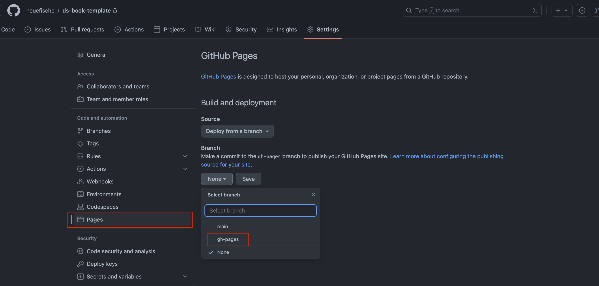

# Data Science Course Material

This repository is a template repo and contains a collection of all the data science course slides and RATs. 

If you are new to the project you can find helpful information in the [instructions](instructions) folder. You might want to have a look there if you ask yourself...

* [How do I use jupyter slides with the rise extension?](instructions/how_to_use_slides.md)
* [How do I create a new jupyter slide deck?](instructions/how_to_create_new_slides.md)
* [How do I create the orientation slides automatically?](instructions/how_to_create_orientation_slides.md)
* [How do I set the color scheme for spiced respectively neuefische?](instructions/how_to_set_the_color_scheme.md)


This README contains some general information which will help you to setup a new repository for your bootcamp.

- [How to use this repo](#how-to-use-this-repo)
- [Deploying the book](#deploying-the-book-with-gh-pages)
- [Creating the book locally](#creating-the-jupyter-book-locally)


## How to use this repo
Create a new repository for each Bootcamp by **forking** this repository. The main branch of this repository contains all the necessary lecture material and rapid assessment tests. By successively updating the [_toc.yml](DSBOOK/_toc.yml) file the lectures and RATs can be added to the jupyter book. 

### Step by step instructions

1. Create new repo by forking this repository
2. Select the company color scheme for the slides and jupyter book ([see here for more detailed instructions](instructions/how_to_set_the_color_scheme.md))
3. Deploy jupyter book with Github pages ([see here](#deploying-the-book-with-gh-pages)) and bookmark link in course Slack channel
4. Setup virtual environment and use Jupyter Notebook to present slides in [sessions](DSBOOK/sessions/) folder
4. Update [_toc.yml](DSBOOK/_toc.yml) file each day by uncommenting the respective lines for lectures and RATs

### Setup

After creating a new repository for a Bootcamp you can setup the virtual environment.

>Requirements:
>- python >= 3.11.3
>- just (`brew install just`)
>- jupyter notebook < 7 (version 7 and later will break our extensions!)

The justfile in this repository will create the virtual environment, install all necessary packages and enable the hide-code extension. If you cannot use just, you can also execute the commands in the [Justfile](Justfile) manually.

```bash
just setup-book
```


### Enable Scrolling

Scrolling on slides needs to be enabled locally. In order to do so, use the following commands:

```bash
touch ~/.jupyter/nbconfig/livereveal.json # creates new file
echo '{"scroll": true}' > ~/.jupyter/nbconfig/livereveal.json # adds necessary content
```

### Having slides top aligned instead of centered

Slides alignment needs to be configured locally. In order to do so, use the following command:
```bash
touch ~/.jupyter/nbconfig/rise.json # creates new file
echo '{"center": false}' > ~/.jupyter/nbconfig/rise.json # adds necessary content
```


## Deploying the book with gh-pages 

In order to deploy the book with gh-pages, you'll need to go to the settings of the repository. Click on `Pages`. Make sure source is set to `Deploy from branch` and select in the dropdown menu for branch `gh-pages`. It might take a few minutes, till the url to the deployed jupyter book will be shown here. When merging a pull request the github page will be updated automatically. 



## Creating the Jupyter Book locally

If you want to see a preview of the jupyter book locally you can create the html file with the following commands:

```bash
source .venv/bin/activate
jupyter-book build DSBOOK
```

If you want to re-build the book locally, Jupyter Book will only build the HTML for pages that have been updated since the last time you built the book. You can use the following to force a full re-build:

```bash
jupyter-book build --all DSBOOK
```

After building the book you will get the information on where to find the rendered html in the terminal and can view it by opening the link in a browser.
