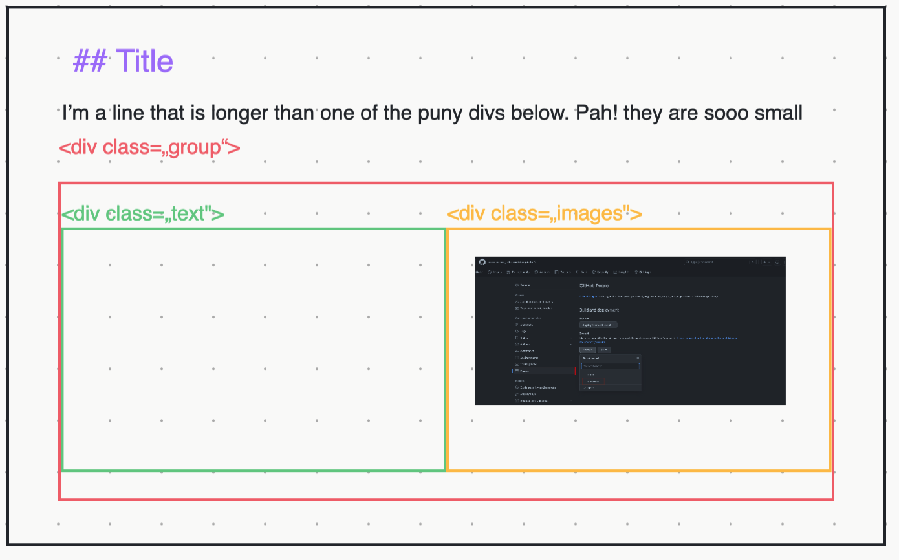
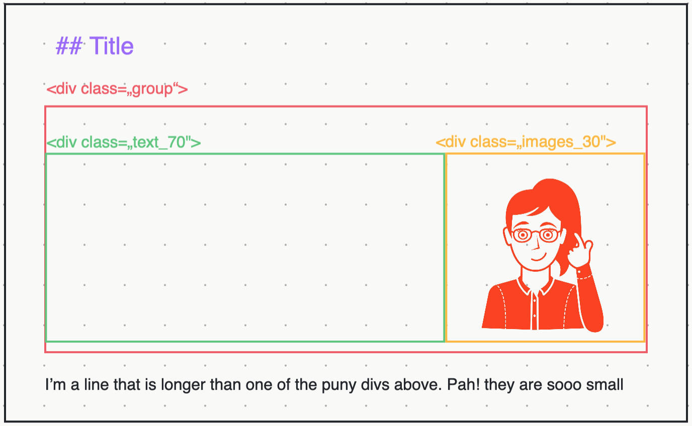
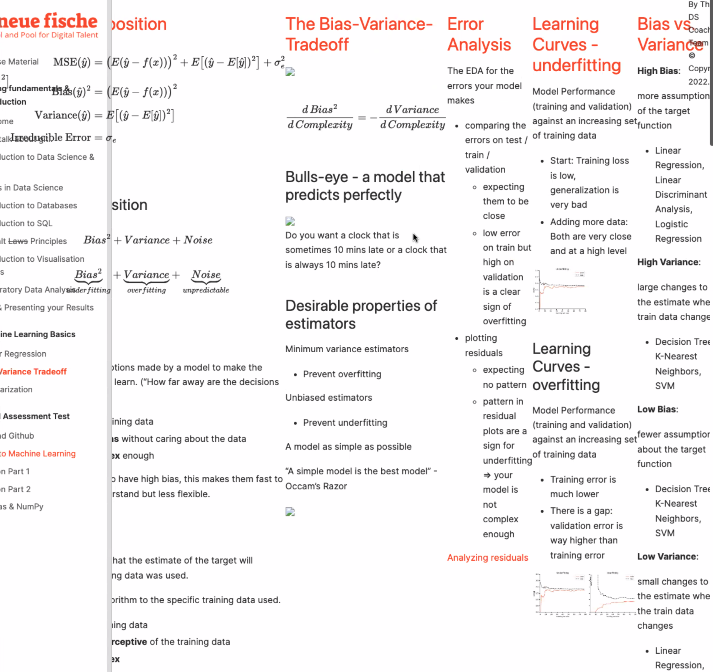

## General remarks
* When you review PRs, please make sure both the slides and the book work as expected. (todo: deploy preview when opening a PR)
* Some images will not be shown in the local version of the book, don't worry about it
* If something is weirdly not working, try to add (or remove) blank lines in front or after the problematic point. If that's not working remove leadings tabs/whitespaces
* If new plots (or colorful images) are included, make sure that both the book and the slides still work (and look reasonable) with both NF and SPICED color schemes.
   
## Formatting
### Structuring a slide

The main structure is set by using "\<div>'s". They come in different classes: "group" is our first level div, "images", or "text" is our second level.
Most slides follow the structure as seen in the images below, with either a 50% / 50% distribution or a 70%/30% distribution. We can also create different classes, that are handled in the rise.css file. (where we can also customize these classes).
As of now, it doesn't matter whether you use images or text, but in the future, we might implement different stylings, so you should (now comes a big surprise!) image for images, and text for texts ;).  If you have longer lines of text, it will wrap according to the width of the div it is put in. So if you want text that spans the whole slide, put it outside of the inner divs. (you can put it into the "group" div, but that is sometimes not working (for whatever reasons). So outside of the group (as shown in the pictures) is the safer choice.
<div>


</div>

### Usage of \<div> tags
Every div that is opened (\<div>), needs to be closed again(\</div>). Be careful not to add extra closing divs -- they lead to strange (very strange!) hard-to-track behavior.



If you have a closing div (\</div>) after a formula, it must not be indented. Else, you will see an error in the slides. If the \</div> is after text, on the other hand, using indentation is fine.

### Usage of  \<div> tag + headlines
If you have a headline/ title (like ## title) it must be outside of \<div>'s, ideally directly in the first line.


## Formulas
Generally, we use LaTeX to render our formulas. Three main options are available.
wrap the formula in \$ formula \$ or in double \$\$ formula \$\$. More complex formulas can be included in an \"align" environment.
1. Single dollar: if you want to just use a subscript or a small formula embedded in intext (so it appears in the same line) single dollar signs are your friend.
```markdown
I like my x-es squared! $x^2$ .. yap that's the best way.
```

2. Double dollar. if you want the formula to show up in an extra line and centered, double dollar signs are your friend.
Double dollars, should be in an extra line without leading whitespaces or tabs. Prior to the Double dollar line, there needs to be one blank line!
Example:
```latex
I once walked into a mathematician's regular table shouting:

$$ a^2 +b^2 = c^4$$
And people were shocked. SHOCKED I TELL YOU!
```

3. If you have several formulas that need to be aligned with each other, e.g. an equation system or to show how to transform one formula to another, use align.
align begins with a $$\\begin{align} and ends with \\end{align}$$ if you omit the $$, it will work with slides but not in the book! the point you want to use for aligning across lines (typically an equation sign) is marked with an ampersand (\&).
inside of the align, there can be no empty lines.
if you want to do a linebreak within the align, use \\\\, if you want to add some extra space between lines, you can include a distance (e.g. \\\\[10pt])
if you want upright text, use the \text{something} command.
Example:
```latex
$$\begin{align}
\hat{y} &= b_{0}+b_{1}x_{1}+\text{...}+b_{m}x_{m} \\
e &= y-\hat{y} \\
\text{MSE} &= {\frac{1}{n}}\sum_{i=1}^{n}{(y_{i}-{\hat{y}}_{i})}^{2}
\end{align}$$
```

## Lists
Markdown allows lists that just start with asterisks (\*). That kind of works for both the slides and the books. However, the styling of that is less than optimal.
It's much better to instead use HTML-styled lists, those we can customize to our needs using the css file. So you should always prefer HTML style lists over Markdown style lists.
[Lists in HTML](https://www.w3schools.com/html/html_lists.asp)
So this is a nice list:
However, please if you are using lists think about whether you need an introduction sentence to frame the lists. Also, not everything needs to be a list. It's annoying to just have random thoughts without connections on a slide:

Good:
```html
Here are some famous hot drinks:
<ul>
  <li>Coffee</li>
  <li>Tea</li>
  <li>Chocolate Milk</li>
</ul>
```

Not good:
```html
<ul>
  <li>Linear Regression is great</li>
  <li>Gradient Decent exists</li>
  <li>I lost my wallet yesterday</li>
</ul>
```
\"...  and next slide \"

## Vertical distances
If you use \<p>, you should also use \</p>. Yes in other HTML environments, it's not necessary, but chances are quite high that it will break the book if you don't. However, it is much better to use one (or more) \<br> tags, which works fine without closing it.
