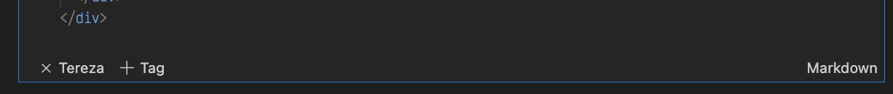

# Creating orientation slides automatically


The [orientation slides](../DSBOOK/sessions/01_Orientation.ipynb) for the intro session on the first day of the bootcamp are in the DSBOOK/sessions folder. 
For each bootcamp the slides for the lead coach, bootcamp manager and the course ID need to be adjusted. Please use the [orientation_slides.py](../scripts/orientation_slides.py) in the scripts folder for this purpose. 

There is a separate notebook [00_Team_Slides](../DSBOOK/sessions/00_Team_Slides.ipynb) containing the introductory slides/cells for each team member in the sessions folder. Running the `orientation_slides.py` file will automatically create the slide deck for a specific bootcamp with the provided lead coach and bootcamp manager. 

> Note: Make sure you run the python file from within the scripts folder. If you run it from another folder, you will need to set the path to the `01_Orientation` and `00_Team_Slides` manually.

## Example for creating a slide deck:

```python
python orientation_slides.py --lead=Larissa --manager=Mia --course_id=hh-ds-23-9
```

## The following tags are available: 

```python
Usage: orientation_slides.py [OPTIONS]

Options:
--lead TEXT            Name of the lead coach. [necessary]
--manager TEXT         Name of the bootcamp manager.[necessary]
--coach TEXT           Name of third coach [optional]
--course_id TEXT       Add course id (e.g. cgn-ds-23-1) [necessary]
--orientation_nb TEXT  Path to orientation notebook. [optional]
--team_nb TEXT         Path to team notebook. [optional]
--help                 Show this message and exit.
```

## Adding new team members

In order to add a new team member, go to the [00_Team_Slides](../DSBOOK/sessions/00_Team_Slides.ipynb) and create a new cell in the same format as the already existing ones. It is important that the tag of the cell is created/updated too and set to the name of the new member. If you copied a cell, click on the little plus sign to add a new tag and don't forget to remove the old tag by clicking on the little x next to the name.

