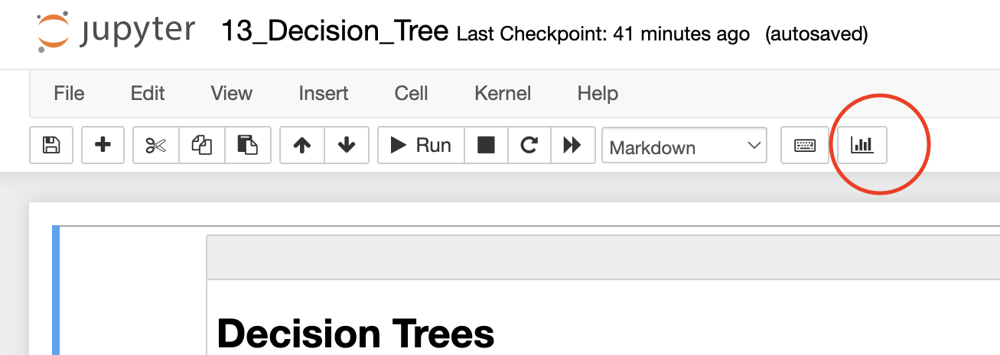

## Rendering the slides with rise

For rendering our jupyter notebooks as slides we use the [rise](https://rise.readthedocs.io/en/stable/) extension. Currently rise only works with the classic Jupyter Notebook and not with JupyterLab. Furthermore, we use the hide-code extension to hide code cells in the slideshow.


You can start Jupyter Notebook with:
```bash
source .venv/bin/activate
jupyter notebook # with or without dash inbetween doesn't matter, both work
```

The slides are stored in the [DBOOK/sessions](../DSBOOK/sessions/) folder (due to the path of the images you need to start jupyter from the root of the repo). In Jupyter Notebook you can open any of the notebooks and start the slideshow by clicking on last icon on the top:




## Helpful keyboard shortcuts

Some keyboard shortcuts might make your life a lot easier. 

| Shortcut | Action | 
|----------|--------| 
| space | Use the space bar to move to the next slide.  |
| space and shift together | Use space and shift together to move to the last slide | 
| t | Clicking t opens the speaker notes. | 
| cmd and + | If you want to zoom in on a slide, you can use the usual keyboard combination for this. On Mac it is cmd and +. | 
| cmd and - | To zoom out on a slide you can use (on Mac) cmd and -. | 

> Note: Space and space+shift are the preferred way to navigate rise. You could also use the arrow keys, but this might not result in the correct slide order especially if you include sub-slides into your slide deck.


## To-dos before giving a lecture

* Run the notebook before you give a lecture.

One advantage of having our slides as jupyter notebooks is the possibility to include code. We tried to make use of it where ever we could and included a lot of the figures that were previously pictures as plots created with matplotlib and co.. In some presentations we even train some models... To make sure that everything is correctly displayed when giving a lecture, rerun the notebook when you open it.
